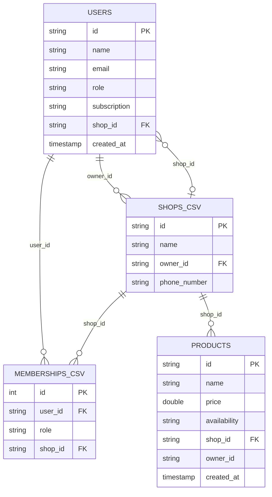

# MakeShop Data Lake: diagrama entidad/relacion

El catalogo de Glue contiene cuatro tablas creadas a partir de los archivos que
suben los tres contenedores de ingesta:

Las relaciones se aplican en las consultas de Athena; Glue no crea claves
foraneas fisicas entre tablas provenientes de bases de datos distintas.

## Evidencia requerida

- Consulta 1: productos con tienda y propietario.
- Consulta 2: usuarios asignados a tiendas.
- Consulta 3: membresias con usuario, tienda y propietario.
- Consulta 4: resumen agregado por tienda evitando multiplicacion de conteos.
- Vista 1: `v_tienda_resumen`.
- Vista 2: `v_usuarios_tienda`.

Las consultas ejecutables estan en `athena_queries.sql`.
